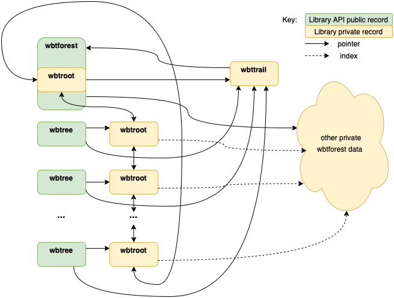
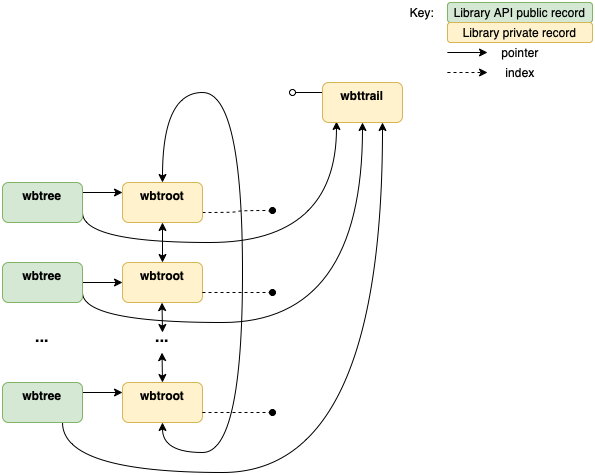

# BBTree GC

The BBTree experiment with Nelua focused on building a BBTree abstraction that
worked in a Nelua GC environment or a Nelua noGC environment. That meant that
the code needed to manage memory on its own.

## The Problem

Since the persistent nature of BBTrees requires structure sharing and
immutability, we need to keep track of live references to the roots of the trees
we can mark reachable tree nodes.

Note that the implementation chosen uses a "forest" of trees stored in a span
of tree nodes. This reduces the size of nodes since we can use indexes into the
span rather than full sized pointers. All trees in the forest are the same type,
generated from the generic type specialized on concrete key and value types.

## Three approaches

Note that the word "roots" is a bit overloaded here. There are three kinds of
roots: *Nelua roots* for Nelua's GC (the stack, registers, static variables, etc.),
the *tree roots* (from which all other nodes of that tree are reachable), and
the *live forest roots* that are inputs to the mark phase of the forest GC. All
the *live forest roots* are *tree roots*, but not all *tree roots* are
*live forest roots*; the *live forest roots* are those reachable from *Nelua roots*.

### Weak Pointers

If Nelua had weak pointers, that might be a good approach. The forest could keep
a table of tree roots keyed by a tree token object returned to the caller of
tree creating functions. When all references to the tree token are gone, only
the weak pointer in the table is left, and it is removed from the table by the
Nelua GC. Iterating the table identifies all the live tree roots. Without weak
references, though, we needed another way.

### Surrogate Records to a List of Tree Roots

The second approach considered, and the first implemented, is to keep a doubly
linked circular list of tree roots, and return a `wbtree` record that points to
the list entry and the `wbtforest` to identify the tree. A `__gc` metamethod on
the `wbtree` record removes the root from the list.

A bug: the test code for this approach mostly worked, but for one case where the
`wbtforest` is destroyed before all the issued `wbtree` records. This occurred
in the unit tests when a stack allocated `wbtforest` went out of scope. One
could argue that this is a programmer error, but does Nelua offer any guarantees
about order of finalization if a `wbtforest` and `wbtree` records become garbage
in the same gc cycle?

### A Safer Approach

A surrogate record for the `wbtforest` is used to prevent access to `destroy`'d
forests. This surrogate is called the `wbttrail` and contains a pointer to the
`wbtforest`, and a copy of the memory allocator used by the forest. The allocator
is used to `destroy` the list items and eventually the `wbttrail` itself once the
list of tree roots is empty. The `wbttrail` has it's `wbtforest` pointer set to
`nilptr` when the forest is destroyed.

This `wbttrail` record is used in place of a direct pointer to the `wbtforest`
when a `wbtree` is created. The `wbtree` API functions check that the `wbttrail`'s
forest pointer is not `nilptr` before accessing the forest.

## Forest Structure

## Deallocated Forest with Live Trees

